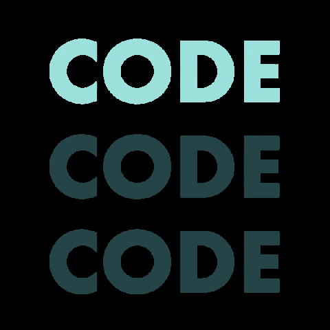

### Hello devs and curious

 
  

 

 Codding is the best way to have fun

 
  
 
    
    <h1 align="center">Linguagens de maior interesse</h1>
    
    

   

    

## Redes sociais

  
  

<!--
**TheoOdawara/TheoOdawara** is a ✨ _special_ ✨ repository because its `README.md` (this file) appears on your GitHub profile.

Here are some ideas to get you started:

- 🔭 I’m currently working on ...
- 🌱 I’m currently learning ...
- 👯 I’m looking to collaborate on ...
- 🤔 I’m looking for help with ...
- 💬 Ask me about ...
- 📫 How to reach me: ...
- 😄 Pronouns: ...
- ⚡ Fun fact: ...
-->
